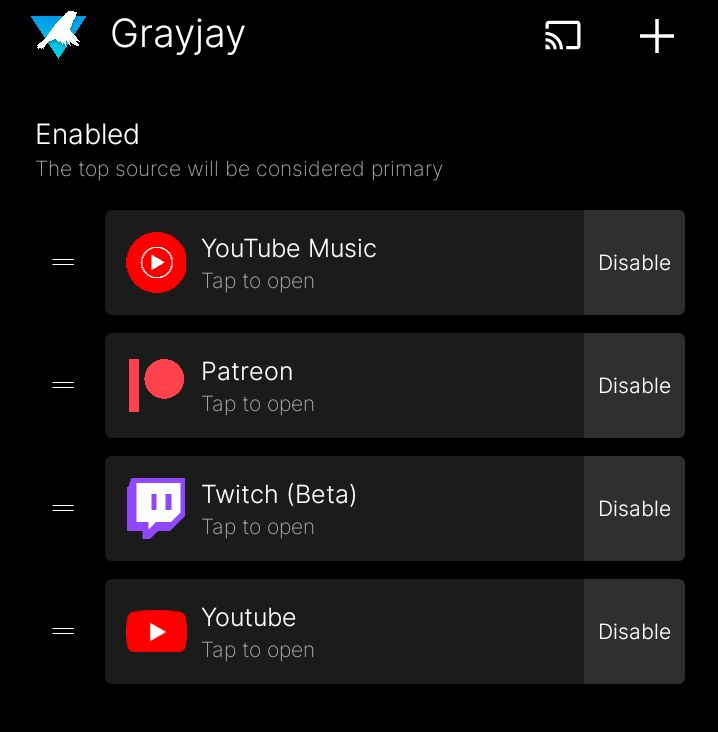

# My Grayjay plugins
I am making multiple, as seen below

Current status: 
## Medium.com
**Version**: `N/A`

This plugin is not actually possible yet, because they still have yet to develop something for articles, currently only platform posts are supported and it doesn't work with that, but I'm keeping the js file in case they add it in
## Youtube music
**Version**: `3`

This is a work in progress. Currently you can see *something* work, but it isn't much so if you're looking for a fully developed plugin, check back later.

You can actually install it by this url: `https://tsunami014.github.io/Grayjay-plugins/YTMusicConfig.json` OR by this QR Code:

**PLEASE NOTE**: With this plugin, since it is *Youtube* music, you will need to move the plugin above the regular Youtube plugin in the plugins menu otherwise the regular Youtube plugin will attempt to load the video which it does not have access to and will fail. It can be anywhere above any other plugins, but has to be at least above Youtube. See the below picture for an example:

## Spotify
**Version**: `N/A`

Will work on after the Youtube Music one
