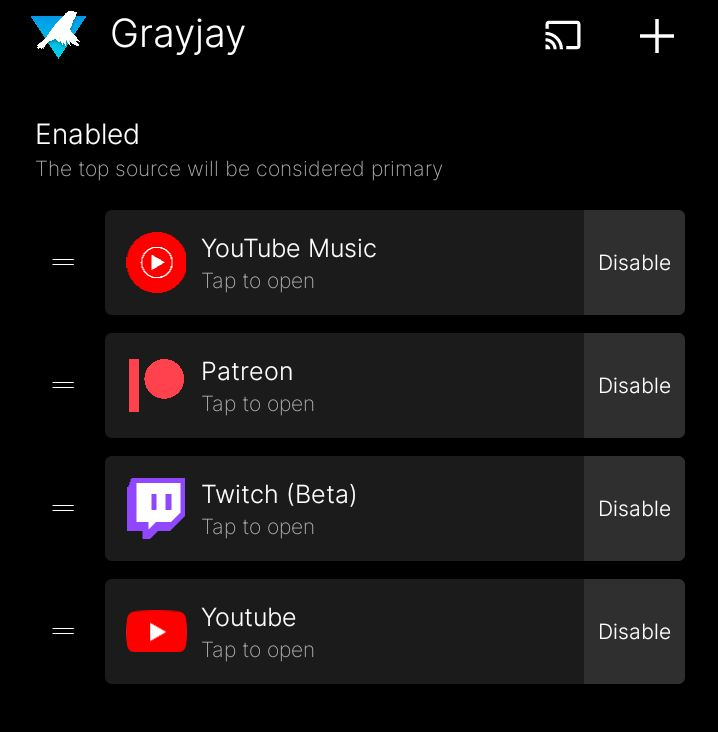

# My Grayjay plugins
> [!NOTE]
> I made this entirely just to see how well I could go and did not expect >0 people to take intrest, so will rarely update it if ever, sorry.

Current status: 
## Youtube music
**Version**: `5`

This is a work in progress and is highly incomplete.

You can install it by this url: `https://tsunami014.github.io/Grayjay-plugins/YTMusicConfig.json` OR by this QR Code:

**PLEASE NOTE**: With this plugin, since it is *Youtube* music, you will need to move the plugin above the regular Youtube plugin in the plugins menu otherwise the regular Youtube plugin will attempt to load the video which it does not have access to and will fail. It can be anywhere above any other plugins, but has to be at least above Youtube. See the below picture for an example:

## Medium.com
**Version**: `N/A`

# For development
For my information so I don't forget and get annoyed for hours ever again, the correct dev url is `http://192.168.XXX.XXX:11337/dev`. Please note the `http`, the `:11337` and the `/dev`.

[Grayjay plugin development docs](https://gitlab.futo.org/videostreaming/grayjay/-/blob/master/plugin-development.md)

[Existing plugins](https://gitlab.futo.org/videostreaming/plugins)
